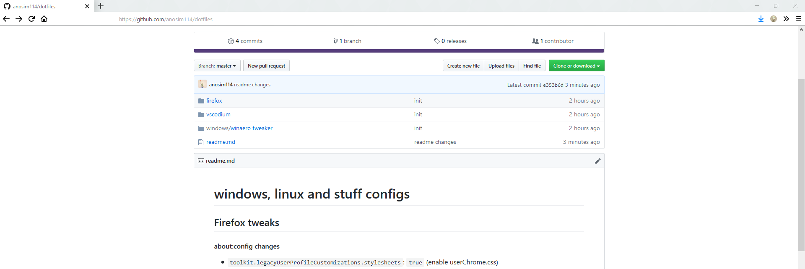

# windows, linux and other programs

## Firefox tweaks

#### about:config changes

- `toolkit.legacyUserProfileCustomizations.stylesheets`: `true` (enable userChrome.css)
- `browser.urlbar.trimURLs`: `false` (returns the http:// in the URL bar)
- `browser.urlbar.suggest.history`: `false`
- `browser.urlbar.trimURLs`: `false`
- `browser.search.suggest.enabled`: `false`
- `extensions.pocket.enabled`: `false`
- `layout.css.backdrop-filter.enabled`: `true`
- `gfx.webrender.all`: `true`

#### Recommended addons

- uBlock Origin
- Violentmonkey
- I don't care about cookies
- HTTPS Everywhere

#### userChrome.css look

## Windows recommended software list

#### Installation, Tweaking, ...
- Chocolatey (package manager for windows to download everything from this list)
- Winaero tweaker (tweak the heck out of it)
- Startisback++ (better startmenu)
- Cmder (better cmd gui)

#### Text Editing
- VSCodium
- Vim
- Notepad++

#### Tools
- Crystal Disk Info (Hard Drive info)
- 7zip
- Git

#### Internet
- Firefox
- FileZilla

#### Video, Images, Media
- OBS Studio
- VLC
- mpv.net (media player)
- nomacs (image viewer)
- PaintTool SAI 2
- Inkscape
